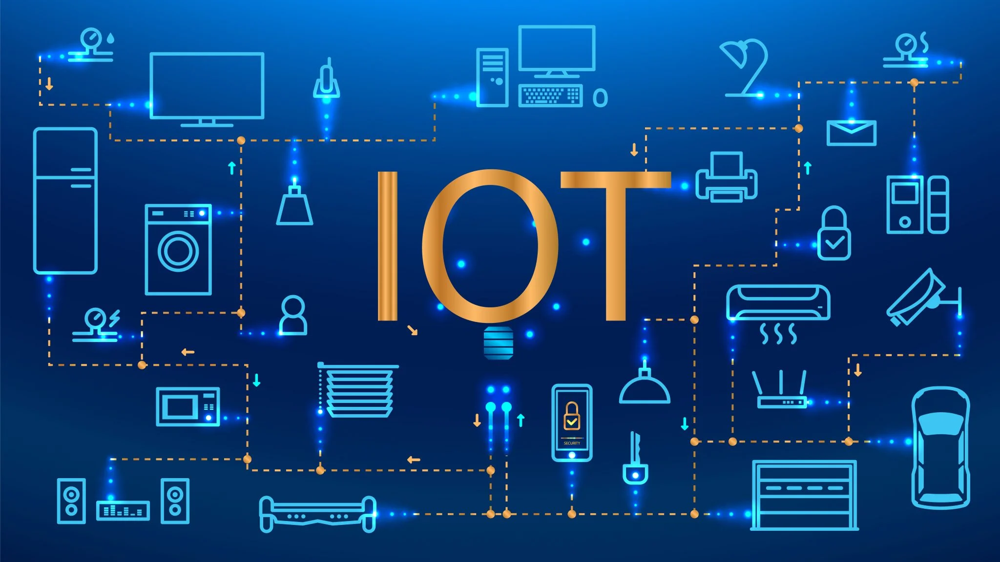

## 
SENSORES Y ACTUADORES

### Profesor: **Ing. Jorge Elías Morales.**

##

### Grupo N° 2:

- Huk, Romina vanesa - [GitHub: RoHu17](https://github.com/RoHu17)
- Brizuela, Laura Analia - [GitHub: gerbena03](https://github.com/gerbena03)
- Roldán, Patricio Leandro -  [GitHub: pleroldan](https://github.com/pleroldan)
- Pantoja, Paola Natalia Alejandra - [GitHub: PaolaaPantoja](https://github.com/PaolaaPantoja)
- Paez, Tiziano Adrian - [GitHub: tpaez](https://github.com/tpaez)
- Integrante 1: GitHub

##

# Descripción del Módulo

Hoy nos encontramos en los inicios de la integración, como nunca, de la inteligencia digital microcontrolada e hiperconectada con las cosas que nos rodean. Esta manifestación de la tecnología impulsada se conoce como loT. De esta forma, con la creciente importancia de los sistemas digitales de comunicación, las interfaces hombre-máquina en el desarrollo tecnológico, los sistemas de producción automatizados, el control automático, la mecatrónica y muchas áreas de estudio científico-tecnológicas, así como la implementación de nuevas tecnologías que permiten un desarrollo más acelerado en los procesos de producción, no serían posibles sin el uso desde sensores y actuadores, hasta las aplicaciones móviles, ya que por medio de estos los sistemas digitales interactúan con el mundo real. Es por ello que a través de este programa se pretende dotar al alumno del conocimiento y las herramientas para poder hacer las implementaciones en forma amplia y acorde de los sistemas de medición, actuación, visualización y comunicación en el loT.

**Duración del Módulo:** 14 semanas, 1 proyecto o práctica por semana.

**Metodología:** ABP, Top-Down, Bottom-Up

**Programa:** 5 unidades

## Criterios de Evaluación Generales

- Claridad y solidez conceptual.
- Uso de vocabulario específico.
- Presentación de las actividades solicitadas atendiendo a los tiempos y formatos requeridos.
- Apertura al diálogo e intercambio respetuoso.
- Predisposición, valoración y participación del trabajo colaborativo, coordinando, cooperando e intercambiando en el propio equipo de trabajo y con otros equipos.
- Aplicación de los contenidos teóricos en las prácticas formativas y profesionalizantes.
- Utilización de estrategias propias para la resolución de problemas en las actividades propuestas.
- En producciones escritas la creatividad, la organización y cohesión del texto, la redacción, ortografía y el respeto por las consignas establecidas.
- La gestión y la regulación de su propio aprendizaje administrando sus propios recursos.
- La reflexión de su propio aprendizaje y de aprender a aprender.
- La identificación de los problemas que se presenten a partir del análisis, jerarquización y priorización de la información.

## Criterios de Evaluación Específicos

- **Comprensión conceptual:** Evaluar la comprensión de conceptos clave relacionados con sensores y actuadores en loT, como tipos de sensores, principios de funcionamiento, tipos de actuadores, etc.
- **Aplicación práctica:** Evaluar la capacidad de los estudiantes para aplicar los conceptos aprendidos en la selección, configuración y uso de sensores y actuadores en proyectos prácticos.
- **Resolución de problemas:** Evaluar la habilidad de los estudiantes para identificar problemas y desafíos relacionados con sensores y actuadores, y desarrollar soluciones efectivas.
- **Diseño de sistemas:** Evaluar la capacidad de los estudiantes para diseñar sistemas loT que incorporen sensores y actuadores de manera eficiente y efectiva.
- **Interpretación de datos:** Evaluar la habilidad de los estudiantes para analizar y sacar conclusiones a partir de los datos recopilados por los sensores en diversas aplicaciones.
- **Programación y control:** Evaluar la capacidad de los estudiantes para programar y controlar sensores y actuadores utilizando lenguajes de programación relevantes y plataformas de desarrollo.
- **Integración de tecnologías:** Evaluar la comprensión de cómo los sensores y actuadores se integran con otras tecnologías en sistemas loT, como la conectividad inalámbrica y la nube.
- **Documentación y presentación:** Evaluar la capacidad de los estudiantes para documentar adecuadamente sus proyectos, procesos de diseño y resultados, así como presentar sus ideas de manera clara y efectiva.
- **Creatividad e innovación:** Evaluar la capacidad de los estudiantes para pensar de manera creativa y desarrollar soluciones innovadoras utilizando sensores y actuadores en situaciones diversas.
- **Colaboración:** Evaluar la capacidad de los estudiantes para trabajar en equipo en proyectos que involucren sensores y actuadores, demostrando habilidades de comunicación y colaboración efectivas.
- **Ética y consideraciones sociales:** Evaluar la comprensión de los estudiantes sobre las implicaciones éticas y sociales de la tecnología loT, incluyendo la privacidad, la seguridad y el impacto en la sociedad.
- **Actualización constante:** Evaluar la disposición de los estudiantes para mantenerse actualizados en un campo tecnológico en constante evolución, demostrando la capacidad de aprender de manera autodidacta.
- **Autoevaluación y reflexión:** Fomentar que los estudiantes sean capaces de autoevaluarse, reflexionar sobre su proceso de aprendizaje y establecer metas de mejora continua.

## Rúbrica

Evaluar las rúbricas de sensores y actuadores en el contexto de Internet de las cosas (IoT) implica tener en cuenta varios aspectos clave para garantizar un funcionamiento eficiente y confiable de los dispositivos conectados.

- **Precisión y Calidad de los Datos:** Los sensores deben proporcionar mediciones precisas y confiables. Evalúa la calidad de los datos generados por los sensores y asegúrate de que estén dentro de los márgenes de error aceptables para su aplicación.
- **Rango de Medición:** Verifica si los sensores y actuadores son capaces de cubrir el rango de medición requerido para la aplicación específica. Es importante que los dispositivos puedan capturar adecuadamente tanto los valores mínimos como los máximos.
- **Latencia y Tiempo de Respuesta:** Evalúa la velocidad a la que los sensores capturan datos y los actuadores responden a las señales de control. En muchas aplicaciones de loT, la baja latencia es esencial para tomar decisiones en tiempo real.
- **Consumo de Energía:** Los dispositivos loT a menudo funcionan con baterías u otras fuentes de energía limitadas. Evalúa el consumo de energía de los sensores y actuadores para garantizar una vida útil razonable de la batería y una eficiencia energética adecuada.
- **Conectividad y Comunicación:** Verifica la compatibilidad de los dispositivos con los protocolos de comunicación necesarios para la conectividad con otros dispositivos o la nube. La elección de protocolos como MQTT, COAP o HTTP puede ser relevante según el caso.
- **Escalabilidad:** Considera si los dispositivos son escalables en términos de agregar nuevos sensores o actuadores a la red existente. La capacidad de expansión es importante para futuras actualizaciones o adiciones a la infraestructura loT.
- **Seguridad:** Evalúa la seguridad de los dispositivos en términos de autenticación, cifrado y protección contra ataques. Los dispositivos loT pueden ser puntos de entrada para ciberataques si no se toman medidas adecuadas.
- **Robustez y Durabilidad:** Los sensores y actuadores en entornos loT pueden estar expuestos a condiciones ambientales adversas. Asegúrate de que los dispositivos sean lo suficientemente robustos y duraderos para resistir condiciones como humedad, temperaturas extremas, vibraciones, etc.
- **Compatibilidad con Plataformas:** Verifica si los sensores y actuadores son compatibles con las plataformas y sistemas operativos utilizados en tu ecosistema loT. Esto facilitará la integración y la gestión de dispositivos.
- **Costo:** El costo de los dispositivos puede variar considerablemente. Evalúa si los beneficios que ofrecen justifican el precio y si encajan en el presupuesto de tu proyecto.
- **Facilidad de Configuración y Mantenimiento:** Considera la facilidad con la que los dispositivos pueden ser configurados y mantenidos. Una interfaz de usuario intuitiva y herramientas de gestión eficientes pueden ahorrar tiempo y recursos.
- **Cumplimiento Normativo:** Asegúrate de que los dispositivos cumplan con las regulaciones y estándares relevantes en tu industria o región. Esto es especialmente importante en aplicaciones críticas como la salud o la seguridad.

Al evaluar Sensores y Actuadores en loT utilizando estas rúbricas, se puede garantizar que se estén cumpliendo los requisitos específicos del proyecto y se estén utilizando las tecnologías más adecuadas para la aplicación en cuestión.
